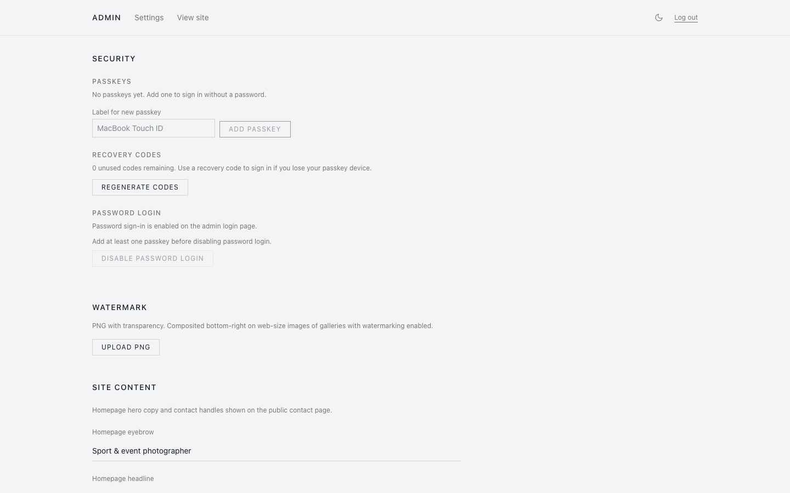

<div align="center">

# gallery-site

**Self-hosted photography portfolio + client proofing galleries — a Pic-Time replacement you own.**

One Next.js app: a public portfolio, private client galleries at unguessable URLs, photo proofing (favorites, comments, downloads), passkey admin login, and safe self-hosted upgrades. SQLite + local files. No external services.

[](https://github.com/Kristian-Buriasco/gallery-site/releases)
[](https://github.com/Kristian-Buriasco/gallery-site/actions/workflows/ci.yml)
[](LICENSE)
[](https://github.com/Kristian-Buriasco/gallery-site/pkgs/container/gallery-site)

</div>

---

## Screenshots

Drop PNGs into [`docs/screenshots/`](docs/screenshots) named `portfolio.png`,
`client-gallery.png`, `admin.png`, `security.png` and uncomment the block below
— they'll render automatically. (See that folder's README for how to capture a
consistent set.)

<!-- Uncomment once the images exist:
|  |  |
|---|---|
| **Public portfolio** | **Client gallery** (proofing) |
|  |  |
| **Admin dashboard** | **Security** (passkeys + recovery) |
|  |  |
-->

## Features

- 🖼️ **Public portfolio** + private **client galleries** (unguessable slug, optional password, expiry)
- ✅ **Proofing**: favorites/selections, per-gallery selection limits, moderated comments
- ⬇️ **Downloads**: per-photo, full-gallery ZIP, or favorites-only ZIP — all streamed
- 🗂️ **Sections** (group by game/team/round), folder upload, drag-reorder & sort
- 💧 **Per-gallery watermark**, EXIF display (**GPS is never stored**), optional shoot location
- 🔑 **Passkey admin login** (WebAuthn) + recovery codes + optional password
- 📊 Admin **stats**, disk usage, bulk actions, likes (portfolio)
- 🛟 **Safe upgrades**: the database is backed up before every migration; a failed migration aborts boot instead of serving a half-migrated DB
- 🎨 Minimal, responsive, **light/dark**, self-contained (no external CDN/fonts/trackers)

## Quick start (Docker)

```bash
git clone https://github.com/Kristian-Buriasco/gallery-site.git
cd gallery-site

export SESSION_SECRET=$(openssl rand -hex 32)
export BASE_URL=https://gallery.example.com   # your real https origin

docker compose up -d --build
docker compose logs -f            # first run prints a temporary admin password
```

Open the site, log in at `/admin/login` with the printed password, then add a
passkey under **Settings → Security**. Put a reverse proxy (Caddy, nginx, NPM)
in front for HTTPS — passkeys require a secure origin.

Prebuilt images: **`ghcr.io/kristian-buriasco/gallery-site`** (pin a version in
production instead of `:latest`).

```bash
docker run -e SESSION_SECRET=$(openssl rand -hex 32) -v gallery:/data \
  -p 3200:3200 ghcr.io/kristian-buriasco/gallery-site:latest
```

## Configuration

Copy `.env.example` to `.env` (or set these in the compose environment):

| Var | Purpose |
|---|---|
| `SESSION_SECRET` | **Required in prod.** Signs/encrypts cookies. `openssl rand -hex 32` |
| `ADMIN_PASSWORD_HASH` | bcrypt hash. Empty → temp password printed on first run. `node scripts/hash-password.mjs 'pw'` |
| `BASE_URL` | Public https origin (share links + WebAuthn). `https://gallery.example.com` |
| `DATA_DIR` | Runtime data root (Docker volume, default `/data`) |
| `PORT` | HTTP port (default `3200`; TLS terminated upstream) |
| `NEXT_PUBLIC_SITE_NAME` | Site name in headers/titles |
| `RP_ID` | Optional WebAuthn RP ID override (defaults to host of `BASE_URL`) |
| `DISABLE_UPDATE_CHECK` | `1` to disable the daily GitHub release check |

All photos and the SQLite DB live under `DATA_DIR`; nothing there is served
statically — every image byte goes through an auth-checked handler.

```
DATA_DIR/
  gallery.db
  backups/gallery-<timestamp>.db     # pre-migration snapshots
  photos/<galleryId>/{originals,web,thumb}/…
```

**Back up `DATA_DIR`** — it is your galleries and database.

## Updating

- **Docker:** `docker compose pull && docker compose up -d`. Migrations apply
  on boot after backing up the DB.
- The admin panel shows a badge when a newer release exists (opt out with
  `DISABLE_UPDATE_CHECK=1`).

## Bare-metal (without Docker)

```bash
npm ci && npm run build
# copy .next/standalone, .next/static, and drizzle/ to your host, then:
SESSION_SECRET=… BASE_URL=… DATA_DIR=/var/lib/gallery/data node server.js
```

Templates in [`deploy/`](deploy): a `systemd` unit and an `update.sh` helper.
Native modules (`sharp`, `better-sqlite3`) must be built for the host platform
(`npm rebuild`). On older toolchains that can't compile `better-sqlite3` v12
(needs C++20), pin `better-sqlite3@11.10.0`.

## Development

```bash
npm ci
cp .env.example .env      # set SESSION_SECRET
npm run dev               # http://localhost:3200
```

See [CONTRIBUTING.md](CONTRIBUTING.md). Checks: `npm run typecheck`,
`npm run lint`, `npm run build`.

## Stack

Next.js 15 (App Router, standalone) · SQLite + Drizzle + better-sqlite3 (WAL,
migrations at boot) · sharp (in-process queue) · Tailwind · iron-session ·
`@simplewebauthn` · archiver. Only native modules: `sharp`, `better-sqlite3`.

## Security

Single-admin, self-hosted. See [SECURITY.md](SECURITY.md) for the model and
private vulnerability reporting.

## License

[AGPL-3.0-only](LICENSE) — Copyright (C) 2026 Kristian Buriasco. A modified
version run as a network service must make its source available (AGPL network
clause).
