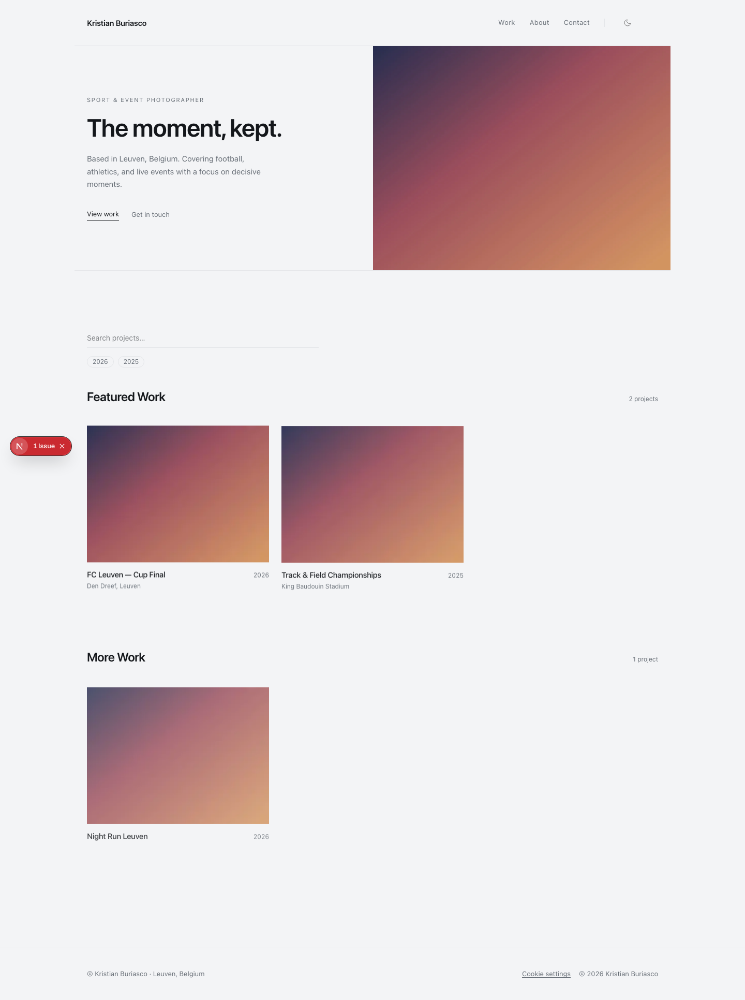
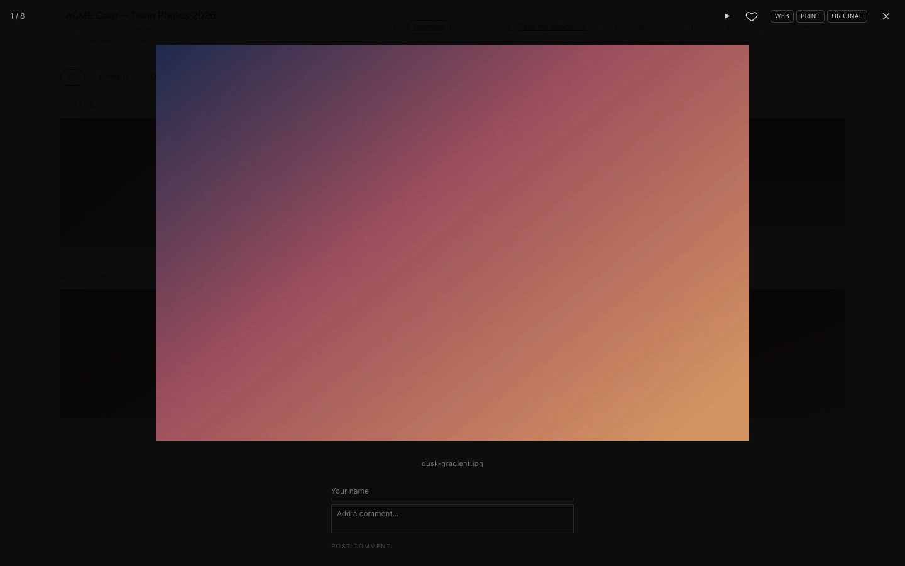
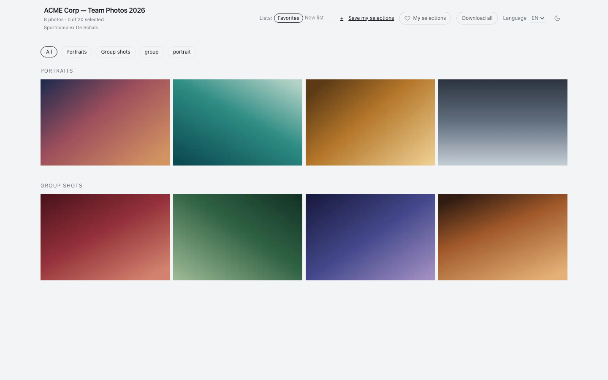
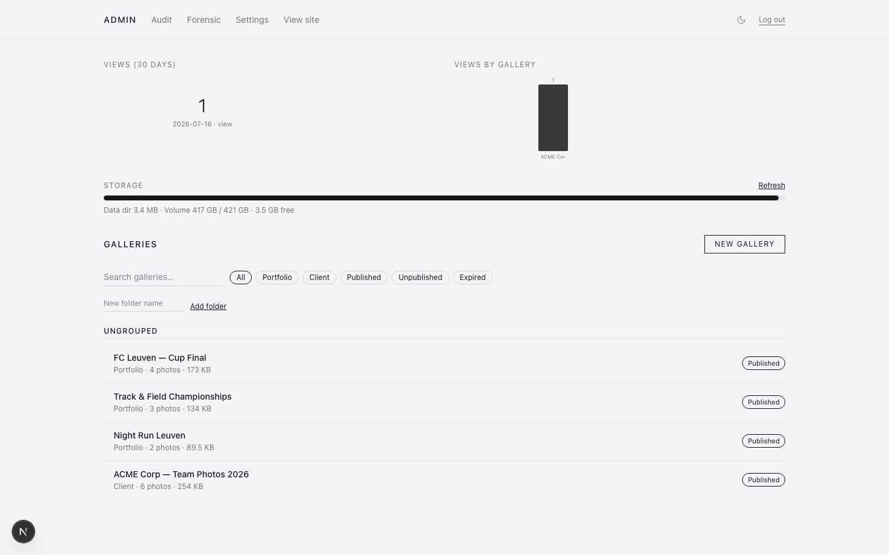
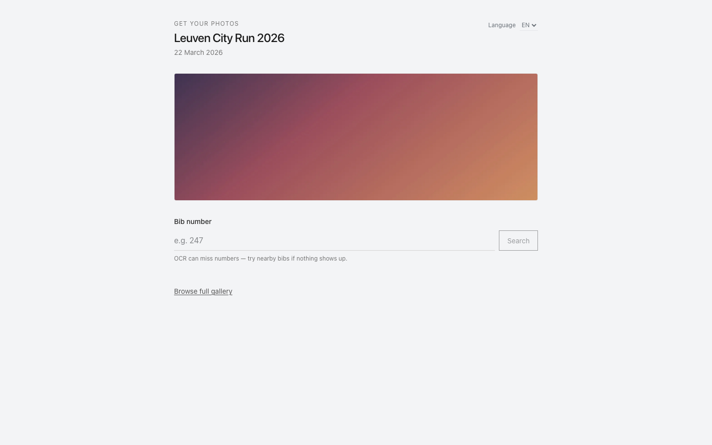

<div align="center">

# Albm

**Your photography business. Your server. No monthly gallery fees.**

Albm is a self-hosted portfolio and client proofing platform for photographers who want Pic-Time-style delivery without the subscription. Publish your public work, share password-protected client galleries with favorites and downloads, and keep every photo on hardware you control — one Next.js app, SQLite, local files, no external services.

[](https://github.com/Kristian-Buriasco/albm/releases)
[](https://github.com/Kristian-Buriasco/Albm/actions/workflows/ci.yml)
[](LICENSE)
[](https://github.com/Kristian-Buriasco/albm/pkgs/container/albm)
[](https://github.com/Kristian-Buriasco/albm/wiki)

</div>

## See it in action

<p align="center">
  <a href="https://github.com/Kristian-Buriasco/albm/wiki/Screenshots">
    
  </a>
  <a href="https://github.com/Kristian-Buriasco/albm/wiki/Screenshots">
    
  </a>
</p>

<p align="center">
  <em>Showcase your work publicly — then deliver the same polish in private client galleries.</em>
</p>

<details>
<summary><strong>More screenshots</strong> — admin, events, security, audit log</summary>

<p align="center">
  <a href="https://github.com/Kristian-Buriasco/albm/wiki/Screenshots"></a>
  <a href="https://github.com/Kristian-Buriasco/albm/wiki/Screenshots"></a>
  <a href="https://github.com/Kristian-Buriasco/albm/wiki/Screenshots"></a>
</p>

</details>

<p align="center"><a href="https://github.com/Kristian-Buriasco/albm/wiki/Screenshots"><strong>Full screenshot gallery → Wiki</strong></a></p>

## Why Albm?

| | | |
| :---: | :---: | :---: |
| **Own your data** | **Client proofing** | **No monthly fees** |
| Galleries, database, and originals stay on your server or NAS — back up one volume and you're done. | Password-protected galleries, favorites, downloads, watermarks, and event pages your clients actually use. | Self-hosted and AGPL. Skip the SaaS bill; pay for hosting you already control. |

## Quick start

Try it locally in a few minutes with Docker:

1. **Clone** — `git clone https://github.com/Kristian-Buriasco/albm.git && cd albm`
2. **Configure** — set a session secret (required) and your public URL:
   ```bash
   export SESSION_SECRET=$(openssl rand -hex 32)
   export BASE_URL=https://gallery.example.com   # use http://localhost:3200 locally
   ```
3. **Run** — `docker compose up -d --build` (listens on port **3200**)
4. **First boot** — `docker compose logs -f` prints a **temporary admin password** when no `ADMIN_PASSWORD_HASH` is set
5. **Secure** — log in at `/admin/login`, add a passkey under **Settings → Security**, and put HTTPS in front for production

Production image: [`ghcr.io/kristian-buriasco/albm`](https://github.com/Kristian-Buriasco/albm/pkgs/container/albm) — pin a release tag instead of `:latest`.

Full walkthrough: [**Wiki → Quick Start**](https://github.com/Kristian-Buriasco/albm/wiki/Quick-Start) · [**Releases**](https://github.com/Kristian-Buriasco/albm/releases)

## Documentation

| | |
|---|---|
| [**Wiki**](https://github.com/Kristian-Buriasco/albm/wiki) | Features, config, deployment, FAQ |
| [docs/EXPORT.md](docs/EXPORT.md) | Lightroom / Capture One publish API |
| [SECURITY.md](SECURITY.md) | Threat model & vulnerability reporting |
| [**Releases**](https://github.com/Kristian-Buriasco/albm/releases) | Changelog & version tags |
| [**GHCR**](https://github.com/Kristian-Buriasco/albm/pkgs/container/albm) | Container images |

## License

[AGPL-3.0-only](LICENSE) — Copyright (C) 2026 Kristian Buriasco.

**Albm** is maintained by [Kristian Buriasco](https://github.com/Kristian-Buriasco) — sport and event photographer based in Leuven, Belgium.
